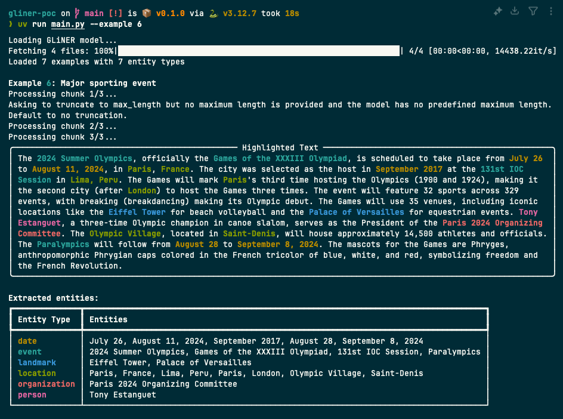

# GLiNER Named Entity Recognition Tool

A proof-of-concept application that demonstrates how to use GLiNER for Named Entity Recognition (NER) on text examples.

## Overview

This tool uses the GLiNER multilingual model to identify and extract named entities from text. It processes examples from a JSON file and highlights different entity types with distinct colors for easy visualization.



## Features

- Process single or multiple text examples
- Handle long texts by splitting them into overlapping chunks
- Highlight entities with color-coded formatting
- Generate summary statistics for entity types
- Support for custom entity types defined in the examples file

## Requirements

- Python 3.6+
- GLiNER library
- Rich library for text formatting and display

## Installation

```bash
pip install gliner rich
```

## Usage

Run the script with default settings to process all examples:

```bash
python main.py
```

Process a specific example by ID:

```bash
python main.py --example 1
```

Use a custom examples file:

```bash
python main.py --file custom_examples.json
```

## Example File Format

The examples file should be a JSON file with the following structure:

```json
{
  "examples": [
    {
      "id": 1,
      "text": "Example text with entities like Apple Inc. and Tim Cook.",
      "description": "Short description of the example"
    }
  ],
  "entity_types": [
    "person",
    "organization",
    "location",
    "date",
    "product",
    "event"
  ]
}
```

## Output

The tool provides:

- Highlighted text with color-coded entities
- A legend showing entity types and their corresponding colors
- A table of extracted entities grouped by type
- Summary statistics when processing multiple examples

## License

This project is licensed under the MIT License - see the [LICENSE](LICENSE) file for details.
